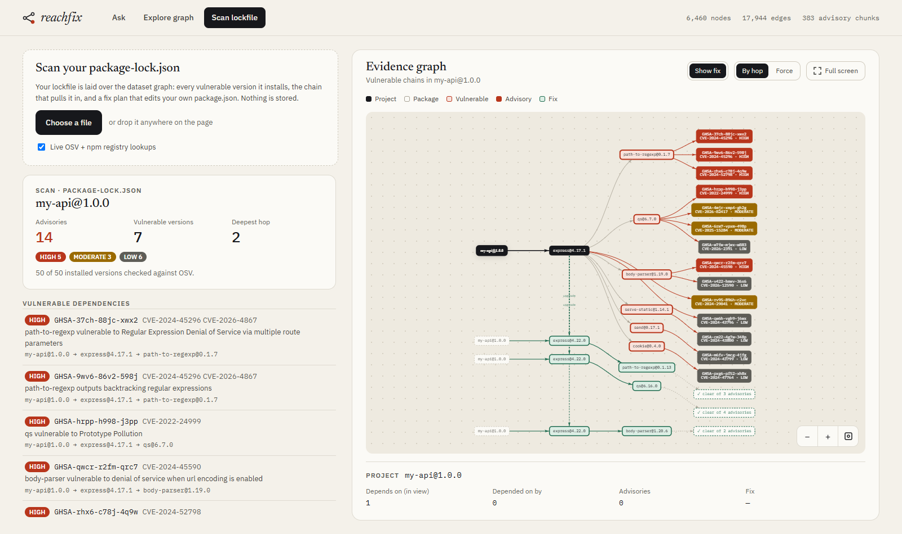
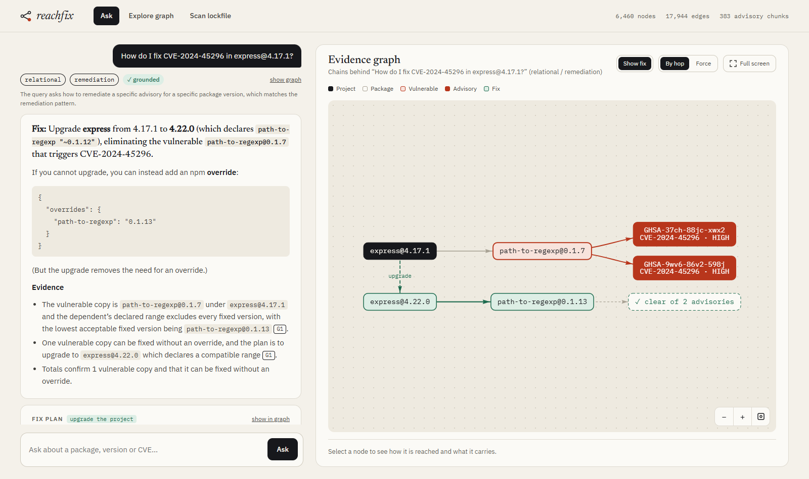

# reachfix

[](https://github.com/JeelPrajapati23/reachfix/actions/workflows/ci.yml)

**Live demo: [reachfix-latest.onrender.com](https://reachfix-latest.onrender.com)**
(free tier: the first request after 15 idle minutes takes about a minute
while the service wakes up)

Which of your projects does a vulnerability reach, through which chain of
transitive dependencies, and what is the smallest upgrade that fixes it
without breaking the version ranges your other dependencies declare?

reachfix combines a dependency/vulnerability knowledge graph with semantic
search over advisory text. It answers multi-hop supply-chain questions
that plain similarity search can't reach, e.g. "is react-scripts@4.0.3
exposed to CVE-2022-0155, and through which chain?" or "what should mocha
8.4.0 upgrade to so it stops pulling in a vulnerable minimatch?"

The graph is mostly deterministic: dependency edges come from npm lockfiles,
and vulnerability ranges come from OSV.dev's structured data. The LLM
handles two narrow, checkable jobs: extracting exploitability conditions
from advisory free text, and writing answers that cite the graph facts and
advisory text they rest on. See [`docs/dataset.md`](docs/dataset.md) and
[`schema/v2.yaml`](schema/v2.yaml).



This project shares its evaluation discipline with a sibling legal-RAG
project (ClauseIQ): provenance on every fact and checked, graph-derived eval
sets, with a different retrieval strategy (graph-guided hybrid retrieval
instead of pure vector search).

## Status

The npm pipeline ("DepGraph") runs end to end over 20 date-pinned projects
(2,466 package versions, 296 OSV advisories):

- **Acquisition and graph:** lockfiles resolved with `npm install --before`,
  OSV advisories, npm registry metadata. Version-level `DEPENDS_ON` edges
  are rebuilt with Node's resolution rule. `HAS_VULNERABILITY` edges come
  from our own semver matching, which agrees with OSV's own matching
  556/556.
- **Retrieval:** a router classifies each question as semantic, relational
  (exposure, affected projects, dependency path, remediation, neighbors) or
  graph-guided hybrid. Advisory text is searched with windowed MiniLM
  embeddings.
- **Remediation:** for each vulnerable copy, the lowest fixed version that
  every dependent's declared range accepts. If a dependent blocks it, the
  upgrade that dependent needs, repeating up to the project itself, with an
  npm `overrides` fallback.
- **Answers:** cite `[G#]` graph facts (readable dependency chains) and
  `[A#]` advisory text with osv.dev links. They are checked for advisory
  ids and package versions that aren't in the evidence.

## Results

Every check is derived from the graph or from OSV, not hand-labelled
(details in [`docs/dataset.md`](docs/dataset.md), outputs in
[`eval/results/`](eval/results/)):

| What | Result |
| --- | --- |
| Our semver matching vs OSV's own affected-version matching | 556/556 agree |
| Uploaded-lockfile scans vs the graph's exposure (the 20 corpus lockfiles re-scanned as uploads) | 20/20 identical |
| Router: route / relational pattern on 24 questions | 23/24 / 22/24 (varies slightly between runs) |
| Answers citing their evidence / grounded (no id or version outside the evidence) | 24/24 / 23/24 |
| Answers mentioning every expected fact (versions, advisories, fixes) | 24/24 |
| Advisory search precision@5 (`minilm_windowed`, by package / by vulnerability class) | 0.735 / 0.775 |

The eval set is small (24 questions), so the classifier prompt is never
tuned against it.



## Try it

The [hosted demo](https://reachfix-latest.onrender.com) has three tabs: ask
a question (cited answer plus the dependency chains drawn as a graph),
explore the graph around a package, version or advisory, and scan your own
`package-lock.json` for exposure and fix plans. Questions are rate-limited
(10 per IP per hour, 100 per day overall); scans and graph exploration are
not. It runs from a prebuilt image (`Dockerfile`) on Render.

Locally:

```bash
uv run python scripts/ask_depgraph.py "Is axios@0.21.1 exposed to CVE-2022-0155?"
uv run python scripts/ask_depgraph.py "How do I fix CVE-2024-45296 in express@4.17.1?"
```

Or serve the chat + graph demo page and HTTP API (`/query`,
`/graph/explore`, `/health`) at http://127.0.0.1:8000:

```bash
uv run reachfix
```

Or use it from an MCP client (Claude Code picks up the repo's `.mcp.json`;
for other clients, run `uv run reachfix-mcp` from the repo directory). The
tools are `list_projects`, `project_exposure`, `affected_projects`,
`dependency_path`, `plan_fix`, `search_advisories`, `explore`,
`scan_lockfile` and `ask`:

```bash
uv run reachfix-mcp                                        # stdio
uv run reachfix-mcp --transport streamable-http --port 8001
```

All of these need the built data under `data/processed/depgraph/`. The build
scripts are listed in order in [`docs/dataset.md`](docs/dataset.md).

## Architecture

```
lockfiles (npm --before) ─┐
OSV advisories ───────────┼─► deterministic/derived edges ─┐
npm registry metadata ────┘                                ├─► graph (NetworkX) ─┐
advisory text ─► chunks ─► LLM exploit conditions ─────────┘                     │
advisory text ─► windowed embeddings ─► vector index ─────────────────────────┐  │
                                                                              ▼  ▼
query ──► router (semantic / relational / graph-guided hybrid) ──► retrieval + remediation plans
                                                                              │
                                              cited answer ([G#] graph facts, [A#] advisory text)
```

## Setup

This project uses [`uv`](https://docs.astral.sh/uv/) for dependency and
environment management.

```bash
uv sync
```

Generation (exploit-condition extraction, router classification, answer
synthesis) runs on Groq (`openai/gpt-oss-120b`), and embeddings run on the
Hugging Face Inference API (`sentence-transformers/all-MiniLM-L6-v2`) —
copy `.env.example` to `.env` and set `GROQ_API_KEY` and `HF_TOKEN`.

## License

MIT — see [LICENSE](LICENSE).
